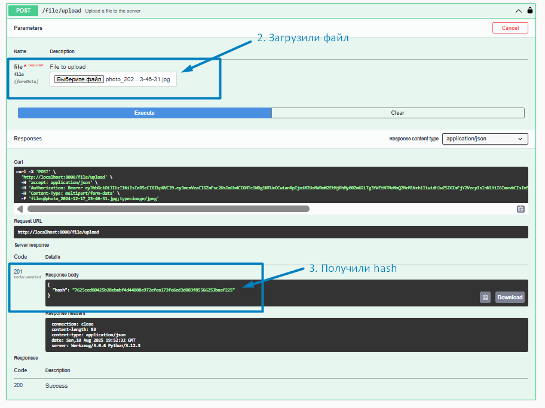

# 📁 File Storage HTTP API Documentation


## 🌟 Overview
A robust file storage service providing HTTP API for secure file operations with authentication.

## 🔗 API Documentation
Interactive Swagger UI available at:  
`http://localhost:8000/swagger/`

## 🔐 Authentication
| Aspect              | Details                                  |
|---------------------|------------------------------------------|
| Type                | Basic Authentication                    |
| Required For        | All endpoints except download           |
| User Management     | Pre-configured users (no registration)  |
| Credentials Format  | `username:password`                     |
| Security            | Recommended for HTTPS only              |

## ⚙️ Requirements
- **Python**: 3.9+
- **Database**: PostgreSQL 13+
- **Containerization**: Docker
- **Dependency Management**: Poetry

## 🚀 API Endpoints
| Method | Endpoint       | Description                | Auth Required |
|--------|----------------|----------------------------|---------------|
| POST   | `/upload/`     | Upload new files           | Yes           |
| GET    | `/download/`   | Download existing files    | No            |
| DELETE | `/files/{id}/` | Delete specific file       | Yes           |

## 🛠️ Installation

```bash
# Clone the repository
git https://github.com/marryivanova/hash-file.git

# Create and activate virtual environment
python -m venv venv
source venv/bin/activate  # Linux/Mac
venv\Scripts\activate     # Windows

# Install dependencies
cd hash-file
pip install poetry
poetry install

# Start database
cd docker
docker-compose up --build
```
or 

```bash
# Clone the repository
git https://github.com/marryivanova/hash-file.git

# Create and activate virtual environment
python -m venv venv
source venv/bin/activate  # Linux/Mac
venv\Scripts\activate     # Windows

# Install dependencies
cd hash-file
pip install poetry
poetry install

# Start database
cd docker
docker-compose -f docker-compose.yml up -d db

# Run migrations
alembic upgrade head  # Make sure to check database URL in alembic.ini

# Start the server
python main.py
```

**Example of work**:

<figure>
  
  <figcaption>swagger api docs</figcaption>
</figure>

<figure>
  
  <figcaption>login</figcaption>
</figure>

<figure>
  
  <figcaption>validate token</figcaption>
</figure>

<figure>
  
  <figcaption>upload file</figcaption>
</figure>

<figure>
  
  <figcaption>chek db file.png</figcaption>
</figure>

<figure>
  
  <figcaption>show file after create</figcaption>
</figure>

<figure>
  
  <figcaption>delete file</figcaption>
</figure>


<figure>
  
  <figcaption>after delete</figcaption>
</figure>

<figure>
  
  <figcaption>download file</figcaption>
</figure>